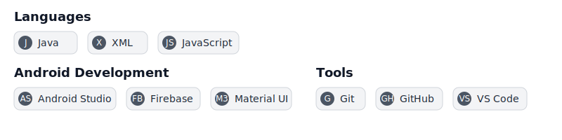
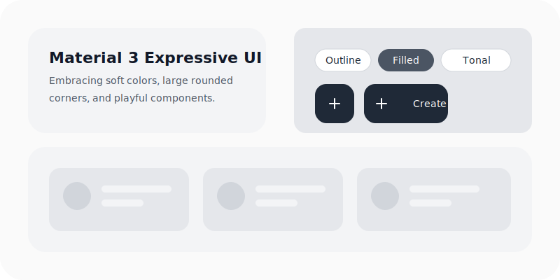

<!-- GitHub Profile README - Minimalist Style -->

# YOUR_NAME
**Android Developer &bull; UI/UX Designer**

 

 
 

---

### About Me

I build modern Android applications with a focus on clean user interfaces, smooth user experience, and practical functionality. I specialize in Java, XML layout design, Firebase integration, and custom UI components.

- **Android Development** &mdash; Crafting robust mobile solutions using Java and XML within Android Studio.
- **UI Design** &mdash; Creating elegant, responsive layouts inspired by modern Design Systems and Material Design.
- **Learning & Exploration** &mdash; Experimenting with AI integration, automation tools, and optimized development workflows.

---

### Tech Stack

  

---

### UI Design Showcase

  

---

### GitHub Stats

  
  

