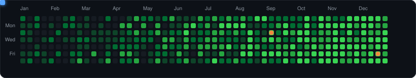

<!-- GitHub Profile README - Futuristic Cyberpunk Edition -->

# SAQIB CIPHER
**Android Developer &bull; UI/UX Designer**

 

<picture>
  <source media="(prefers-color-scheme: dark)" srcset="https://readme-typing-svg.herokuapp.com?font=Fira+Code&size=16&duration=2800&pause=900&color=00F0FF&center=true&vCenter=true&width=600&lines=Android+Web+Developer;Material+Design+Enthusiast;Building+tools+not+just+apps;Exploring+AI+and+Automation">
  <source media="(prefers-color-scheme: light)" srcset="https://readme-typing-svg.herokuapp.com?font=Fira+Code&size=16&duration=2800&pause=900&color=0284C7&center=true&vCenter=true&width=600&lines=Android+Web+Developer;Material+Design+Enthusiast;Building+tools+not+just+apps;Exploring+AI+and+Automation">
  
</picture>

 
 

---

### About Me

I build modern Android applications with a focus on clean user interfaces, smooth user experience, and practical functionality. I specialize in Java, layout design, and Web development.

- **Android Development** &mdash; Crafting robust mobile solutions using Java and XML within Android Studio.
- **UI Design** &mdash; Creating elegant, responsive layouts inspired by modern Design Systems and Material Design.
- **Learning & Exploration** &mdash; Experimenting with AI integration, automation tools, and optimized development workflows.

---

### GitHub Stats & Streak

  <picture>
    <source media="(prefers-color-scheme: dark)" srcset="https://github-stats-extended.vercel.app/api?username=saqib-cipher&show_icons=true&theme=transparent&hide_border=true&title_color=00F0FF&icon_color=00F0FF&text_color=E6EDF3&bg_color=00000000">
    <source media="(prefers-color-scheme: light)" srcset="https://github-stats-extended.vercel.app/api?username=saqib-cipher&show_icons=true&theme=transparent&hide_border=true&title_color=0284C7&icon_color=0284C7&text_color=1E293B&bg_color=00000000">
    
  </picture>
  <picture>
    <source media="(prefers-color-scheme: dark)" srcset="https://github-stats-extended.vercel.app/api/top-langs/?username=saqib-cipher&layout=compact&theme=transparent&hide_border=true&title_color=00F0FF&text_color=E6EDF3&bg_color=00000000">
    <source media="(prefers-color-scheme: light)" srcset="https://github-stats-extended.vercel.app/api/top-langs/?username=saqib-cipher&layout=compact&theme=transparent&hide_border=true&title_color=0284C7&text_color=1E293B&bg_color=00000000">
    
  </picture>

 

  <picture>
    <source media="(prefers-color-scheme: dark)" srcset="https://streak-stats.demolab.com?user=saqib-cipher&theme=transparent&hide_border=true&border_radius=12&date_format=M%20j%5B%2C%20Y%5D&stroke=00000000&ring=00F0FF&fire=FF007F&currStreakNum=00F0FF&currStreakLabel=00F0FF&sideNums=E6EDF3&sideLabels=7DD3FC&dates=38BDF8">
    <source media="(prefers-color-scheme: light)" srcset="https://streak-stats.demolab.com?user=saqib-cipher&theme=transparent&hide_border=true&border_radius=12&date_format=M%20j%5B%2C%20Y%5D&stroke=00000000&ring=0284C7&fire=E11D48&currStreakNum=0284C7&currStreakLabel=0284C7&sideNums=1E293B&sideLabels=0369A1&dates=64748B">
    
  </picture>

---

### GitHub Activity

  <picture>
    <source media="(prefers-color-scheme: dark)" srcset="https://raw.githubusercontent.com/saqib-cipher/saqib-cipher/output/github-contribution-grid-snake-dark.svg">
    <source media="(prefers-color-scheme: light)" srcset="https://raw.githubusercontent.com/saqib-cipher/saqib-cipher/output/github-contribution-grid-snake.svg">
    
  </picture>

