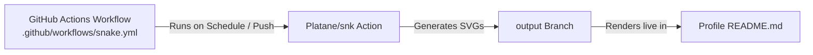

# 🐍 GitHub Contribution Snake Animation Setup Guide

This guide walks you step-by-step through setting up and running the automated **Contribution Grid Snake Animation** on your GitHub Profile (`saqib-cipher/saqib-cipher`).

---

## 📋 How It Works



1. **GitHub Action (`snake.yml`)** runs automatically every 12 hours (and on every push to `main`).
2. It fetches your GitHub activity and generates two animated SVGs:
   - `github-contribution-grid-snake.svg` (Light theme)
   - `github-contribution-grid-snake-dark.svg` (Dark theme)
3. The action pushes these files directly to a dedicated `output` branch.
4. Your [README.md](file:///c:/Users/sddrk/Downloads/github%20profile/README.md) dynamically displays the correct theme animation using HTML `<picture>`.

---

## 🚀 Step-by-Step Setup Instructions

### Step 1: Commit and Push Files to GitHub

Run the following commands in your terminal to push the new workflow and updated README:

```bash
# 1. Stage the files
git add .

# 2. Commit the changes
git commit -m "feat: add snake animation workflow and fix stats"

# 3. Push to your main branch
git push origin main
```

---

### Step 2: Grant Workflow Write Permissions (Crucial)

By default, GitHub Actions workflows have read-only access. You need to grant write permissions so the action can create the `output` branch and commit the SVGs.

1. Open your repository in your browser:  
   👉 **[https://github.com/saqib-cipher/saqib-cipher](https://github.com/saqib-cipher/saqib-cipher)**
2. Click on the **Settings** tab at the top of the repository.
3. In the left sidebar, under **Code and automation**, click **Actions** &rarr; **General**.
4. Scroll down to the **Workflow permissions** section.
5. Select **Read and write permissions**.
6. Check the box for **Allow GitHub Actions to create and approve pull requests**.
7. Click the green **Save** button.

> [!IMPORTANT]
> If you skip this step, the workflow will fail with a `403 Resource not accessible by integration` error when trying to push to the `output` branch.

---

### Step 3: Trigger the Workflow for the First Time

You do not need to wait 12 hours for the first run; you can trigger it manually:

1. Click on the **Actions** tab at the top of your repository.
2. In the left sidebar under *All workflows*, click **Generate Snake Animation**.
3. On the right side, click the **Run workflow** dropdown button.
4. Ensure `Branch: main` is selected, then click **Run workflow**.
5. Wait ~30 to 45 seconds until you see a green checkmark (**✔ Generate Snake Animation**).

---

### Step 4: Verify and View Your Profile

1. After the workflow completes, check your branch dropdown on GitHub: you will see a new branch named **`output`**.
2. Visit your public GitHub profile:  
   👉 **[https://github.com/saqib-cipher](https://github.com/saqib-cipher)**
3. The snake animation will now be live on your profile README!

---

## ⚙️ Advanced Tips & Customization

### Include Private Contributions in the Animation
If you want the snake to eat dots from private repositories as well:
1. Go to [GitHub Profile Settings](https://github.com/settings/profile).
2. Under **Public profile** &rarr; **Contributions & Activity**, check:
   - ✅ **Include private contributions on my profile**.

### Change the Schedule or Color Palette
You can adjust the configuration anytime in [.github/workflows/snake.yml](file:///c:/Users/sddrk/Downloads/github%20profile/.github/workflows/snake.yml):
- **Change run frequency**: Modify the cron expression (e.g., `cron: "0 */6 * * *"` for every 6 hours).
- **Custom palette**: You can specify custom snake and grid colors by adding query parameters to the output lines in `snake.yml`:
  ```yaml
  outputs: |
    dist/github-contribution-grid-snake.svg?color_snake=#0284c7&color_dots=#e2e8f0,#bae6fd,#38bdf8,#0ea5e9,#0284c7
    dist/github-contribution-grid-snake-dark.svg?palette=github-dark&color_snake=#00f0ff&color_dots=#060913,#083344,#0369a1,#0284c7,#00f0ff
  ```

---

## 🛠️ Troubleshooting

| Issue | Cause | Solution |
| :--- | :--- | :--- |
| **Workflow fails with 403 error** | Missing write permissions | Complete **Step 2** to enable `Read and write permissions` in Settings. |
| **Image shows broken / 404** | Workflow hasn't run yet or failed | Run the action manually following **Step 3** and ensure the `output` branch exists. |
| **Animation looks outdated** | GitHub image proxy cache | GitHub caches profile images for a few minutes to hours. Hard refresh your browser (`Ctrl + F5` or `Cmd + Shift + R`). |
